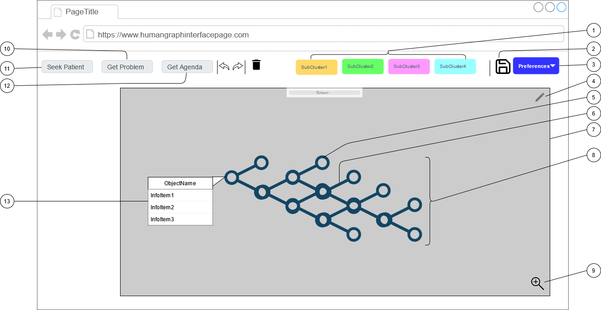

<a href="{{ "/" | relative_url }}">{{ site.theme_config.back_home_text }}</a>

<header>
  <h1>Requirement Specification for Human-Graph Interface
</h1>
</header>

## ToC 
- <a href="#introduction">Introduction</a>
- <a href="#uses">Main Intended Uses</a>
- <a href="#sketch">Interface Sketch</a>
- <a href="#components">Components</a>
- <a href="#actions">Actions</a>

## Introduction
<a href="#home">Top</a>

- Good human interfaces to graphs are very important because it can save much time to persons in charge of the review and maintenance of the Medical knowledge base as well to make possible the creation of graph during consultations.
- Medical users need very easy interface to edit graphs. Therefore, technical formulations like "cypher statements" would absolutely not be accepted
- Computers should provide very flexible and interactive graph presentations in order to be easily understoon by people.
- In order to be trusted, computers must be very transparent, explaining recommended decisions step by step
- Real time interractivity is essential in patient care
- Graphs must contain complete information even if some fields are not yet well structured. Graphs are seen as backbone or as a _table of contents_ at the top level, paying much attention to relations between main concepts represented by nodes. That said, nodes may contain any knd of little less structured information including free text comments, images, or links to external documents.

## Main Intended Uses
<a href="#home">Top</a>

- Knowledge Base
  - Builders and maintainers of medical knowledge grphs will require many relationships between concepts
  - Even if Natural Language Processing of textbooks can provide a good start for knowledge bases, medical experts will remain very necessary for review an corrections
  - Teachers of medicine have to explain to their students multiple relations between concepts. They could like to use graphs in the preparation of their courses. Also expected to e useful in training sessions
  - A knowledge base is intended to contain generic knowledge about symptoms, problems, actions, ... For example, knowledge about the meaning of a lab test appears only once in the knowledge base.
- Patient Record
  - During contact with patients, notes must always be registered immediately. Rather than doing that typing completely free text the idea is to try to do it in a more structured way as graph. This option requires a __very ergonomic interface__. Some NLP could help but the goal is to create graphs, for example converting MIMIC report styles into graphs
  - The expected benefit is to get instantly Assisted Intelligence from the medical knowledge base.
  - A task oriented approach in order to try to solve the problems of the patient. Problems have a central role with links to symptoms and recommended actions. This according to the "Problem Oriented Medical Record" according to L. Weed philosophy.
  - Shared overview of patient's problems and related information will also be very useful for the coordination between the members of the "care team" in charge of a common patient.
  - A patient record is intended to contain instances of information related to a particular patient, as problems, symptoms, treatments, ... These instances are in principle always linked to the corresponding generic knowledge. For example there may be any number of instances of lab results found by many different patients, at different times.
 
## Interface Sketch
<a href="#home">Top</a>

A sketch of the proposed human-graph interface for medical applications is below:

### Components
<a href="#home">Top</a>
1. Selections
   - Selection of a subset of the large database. For example selection in the knowledge base of one disease, or related symptoms, recommended actions...or in case of a patient record selection of one problem with directly related information.
1. Save Button
1. User Preferences Button
   - Selection of certain types of relationships
   - Default selection at the opening of a patient record
   - Preferred style of presentation
   - Logical Options such as:
     - Type, weight, intensity, probability, degree of belief, author (possibility of endorsement), importance, decay in time, 
   - Visual options such as:
     - In general: color, intensity/darkness, text color, background color, text size, blinking, background, movements/oscillations
     - For Node: size, shape, border (color, thickness), position in graph (attraction or repulsion to other types of nodes( The current active node could be moved to screen center), inversed text and background colors, moving nodes
     - For relations: thickness, direction, dashed style
1. Edit Button
1. Active Node
   - Presented with most of his directly related nodes. Users may define preferences about types of relations and number of levels
1. Relation
   - A set of relations will be defined, paying much attention to the difference between causal or only co-occurence relations. The number of usual and predefined relationships type is expected to be about hundred
   - Relations are to be seen as independent objects. For example, the author or a Relation may be different from the authors of the 2 related nodes
   - The same 2 nodes may have multiple relations. For example when 2 authors have different vision of a relation.
   - Relations have direction, but traversal can be in both ways
   - Weight of relations:
     - inside the database weights should be normalized in a scale from 0 to 1. Decision procedures should be based on the best possible values.
     - on visual graph weights are represented by means of thickness of arrows
     - in traditional reports the score should be rounded to adjectives, like "weak" or "strong", "not to exclude" or "certain",...
     - could have several factors having each their own weight, eg, 
       - "degree of belief" vs "probability"
       - "importance" can be seen from different point of view as life expectancy or patient quality of life
       - Frequency of appearance of a symptom in relation to a diagnose should be quantified
1. Main Graph Display Window
1. Current Active Object
   - May be a node or a relation
   - Access and updates of objects will depend on the current user profile and of the transaction type. The exact rules will be specified in a separate document according to "Role Based Access Control" and "Need to Know" principles. Typically the current "care team" of the patient need access to work. For example a nurse needs to read the prescriptions but is normally not allowed to create new ones.
1. Zoom in / Zoom Out Button
1. Get Problems search box
1. Seek patient search box
1. Get agenda search box 
1. OnHover window

 
### Actions 
<a href="#home">Top</a>

1. OnObjectHover 
   - Shows temporarily the content of the node or relation being hovered over, in a popup window. Intended to make it very easy to see quickly the essential of the content.
1. OnObjectActivation
   - Shows the onHover window ina more persistent way, until an explicit save or close.
   - Content of node begins with a few standard information as type, date-time, responsible author, etc...and may include any kind of document, discharge letters, images, etc ...
   - If necessary a cursor in order to see more of a long screen page
   - Possibility to jump to related pages, even on an external server, i.e hypertext facilities, with later come back
   - Edit button activated
     - A set of fields can be proposed; 
       - some fields could accept expression language. Or even maybe voice converted immediately to text.
     - Some standard fields may be mandatory while additional fields are optional 
   - Procedures and Rules
     - Optional activation of procedures must be possible here
     - Specification of these procedures will be discussed in another chapter about decision support
     - Activation
       - Manual in the edit window, in function of predefined changes in the attributes
       - Could also be activated by "events" coming from other procedures, in a cascading sequence of procedures
     - Consequences:
       - Possibility to activate to evaluation and recommendation procedures, specific new selections, to new nodes and relations, to broadcast new events, etc..
1. OnObjectSave
   - If a previous version of the same object exists, generate a new version
   - Previous versions should remain available on request. Indeed it must be possible to retrieve the situation as it was at a given point in time in the past. Important in the context of a team of several actors wh may sometimes have different opinions. Moreover a legal requirement in order to justify a decision based on available information at the time.
   - Changes in nodes could activate **evaluation procedures**
1. OnObjectDelete
   - In principle delete should never be allowed immediately.
   - Relations to a node must have already been deprecated for a node to be deleted
1. Creation of a Node
   - May be created on an empty space, again depending on authorization profile of current user
   - Any new node must be immediately edited, at least with a type and mandatory attributes
1. Creation of a Relation
   - Drag an arrow from one node to another, again, depending on the authorizations of the user
   - Any new relations must immediately be edited, at least with the mandatory attributes
   - Dragging an arrow to an empty location will create a new node
1. Zoom or unzoom 
   - Should provide more or less, from a large overview of top most important node to full detail of a specific subset of the graph
 